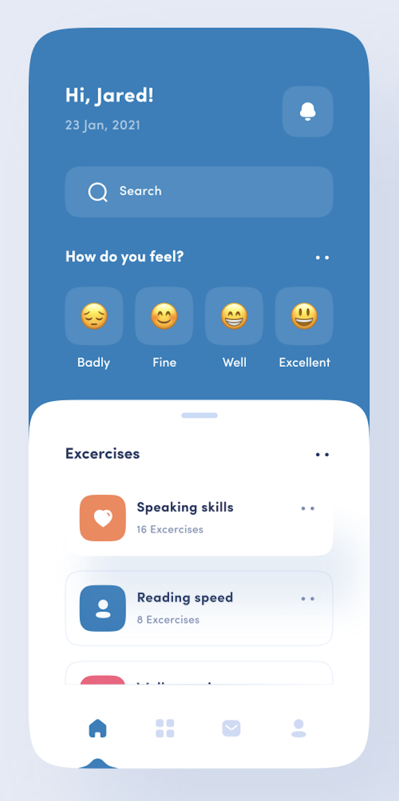

# CSS challenge

## Task

We would like you to implement the following design concept:

In the `src` folder there are three files: `index.js` which you can ignore,
`App.css` and `App.js`.

You sould edit the `App.css` and `App.js` files.

You don't need to be pixel perfect its ok if the font sizes and spacing are slightly different, but try to match the design closely. 

Your finished piece doesn't need to be fully responsive, but it shouldn't
completely explode on smaller or larger screen sizes.

You don't need to worry about finding the exact font that's used (you could
probably pick something nicer than Times New
Roman 😉).

Please add some screenshots demonstrating your work too.

## Setup

You need to have [Node](https://nodejs.org/en/) installed.

## Available Scripts

In this directory, you can run:

### `npm start`

Runs the app in the development mode.\
Open [http://localhost:3000](http://localhost:3000) to view it in the browser.

The page will automatically update if you make edits.

### `npm run format`

This will format your code automatically.

## Evaluation criteria

Here's what we are looking for to figure out if this is a good solution:

- Does it look like goal.png
- Do your css class names help to understand your styling
- Will it work in Chrome and Firefox (or Safari)?

Here are some things you _shouldn't_ do

- Set up a linting framework
- Spend _any_ time getting it to work in internet explorer
- Spend time supporting outdated browser features, if it is supported in the latest Chrome, Firefox / Safari and the mobile versions you are good to go
- Spend _any_ time manually formatting your code (get the computer to do thisfor you! Most editors have an auto-format feature, use that)
- Get someone else to do this for you (we follow up with an in-person exercise)
